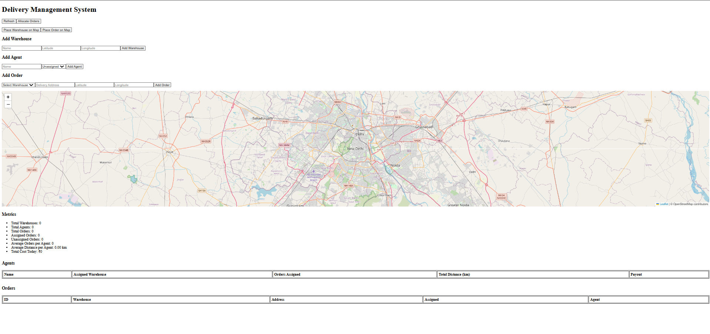
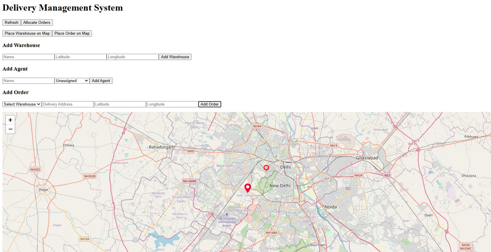
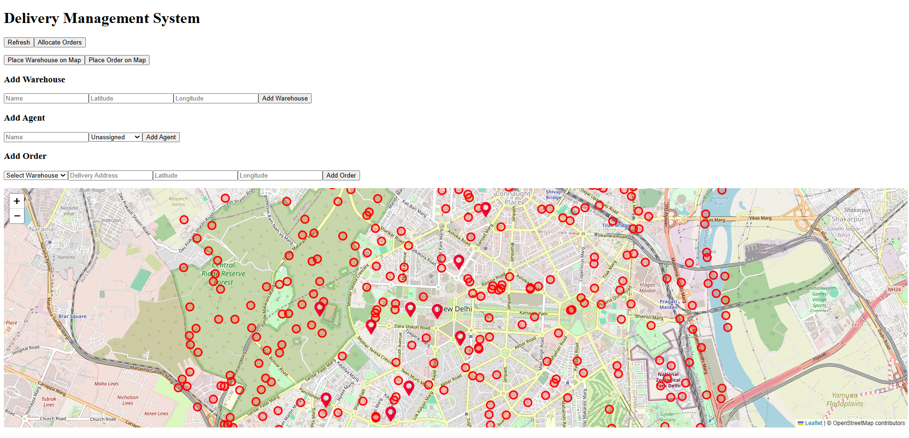
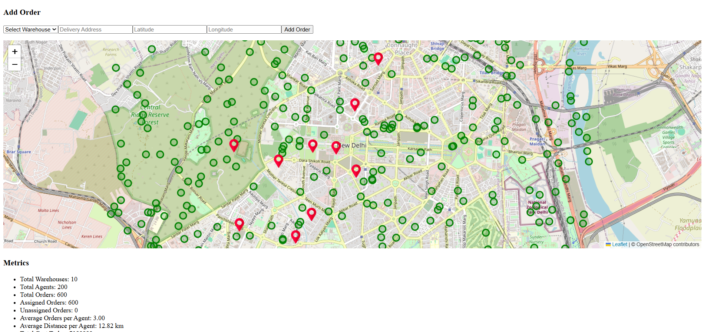
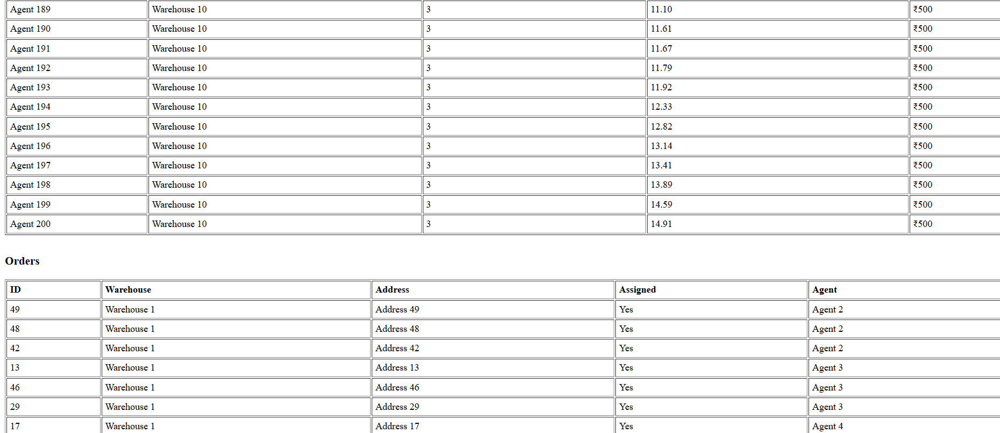

# Delivery Management System

A full-stack delivery management system built with Go (Gin) for the backend and Vue (Vite) for the frontend.

---

## Prerequisites

- Go 1.18+
- Node.js 16+
- PostgreSQL

---

## Backend Setup

1. **Clone the repository:**
   ```sh
   git clone https://github.com/yourusername/yourrepo.git
   cd yourrepo
   ```
2. **Configure environment variables:**
    - update `.env` with your database credentials
    ```bash
    DB_HOST=localhost
    DB_PORT=5432
    DB_USER=postgres
    DB_PASSWORD=mysecretpassword
    DB_NAME=mydatabase
    DB_SSLMODE=disable
    ```
3. **Backend setup**
    - Install dependencies:
        ```Go
        go mod tidy
        ```

    - Run the backend:
        ```Go
        go run main.go
        ```

    The backend will start on http://localhost:8080.
4. **Frontend Setup**

    - Navigate to the frontend directory:
        ```bash
        cd frontend
        ```

    - Install dependencies:
        ```bash
        npm install
        ```

    - Run the frontend:
        ```bash
        npm run dev
        ```

    The frontend will start on http://localhost:5173.

## Implementation
**Backend**:
Developed in Go using the Gin web framework. .

**Frontend**:
Built with Vue.js and Vite for a fast, reactive user interface. Leaflet for handling map renders and axios as the browser HTTP client.

**Database**:
PostgreSQL is used as the relational database, storing all core data such as users, deliveries, and statuses.




we can use the `place warehouse on map` and `place order on map` to put warehouses and orders on the map, and these will get synced to the db. We can also add agents using the form.




## **Algorithm**
The backend uses a modified **round-robin algorithm** for even allotment of orders to agents, minimising the cost incurred.

**Key Characteristics:**

- Cycles through agents in sequence: Agent1 → Agent2 → Agent3 → Agent1 → ...
- Fair distribution - each agent gets equal opportunity
- Good for workload balance


Alternatively I have also written a **least loaded algorithm** that we can switch to, for better individual utilisation of agents.

**Key Characteristics:**

- Always prioritizes agent with fewest current orders
- Maximizes individual agent utilization
- Better for reaching higher payout tiers (25+, 50+ orders)

## Testing

> There is a `internal/db/seed.sql` file in the repo, that we have written to seed test data into our database. It generates -
- **60** **orders** in a day/agent
- **20 agents** per warehouse
- **10 warehouses** around New Delhi (Arbitrarily chosen city).


- The map render after seeding using our script

Now we can click `Allocate orders` button to allocate these orders


UI will give us the metrics at the bottom of the page

We can scrolling for metrics on orders

